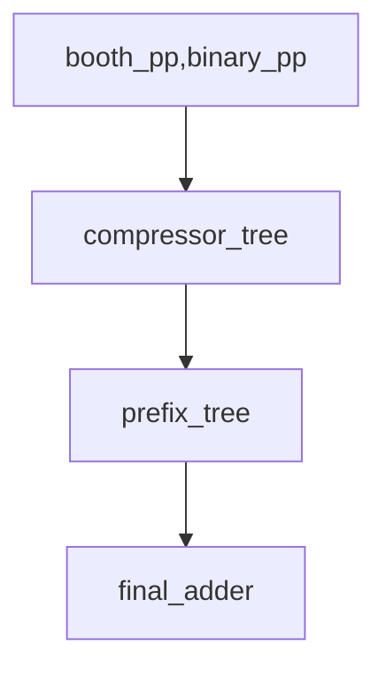

# Integer Multiplier Design and Implementation [Part of ECE 493]

## Project Objectives

The goal of this project is to complete the following tasks:

1. Write parametric Ripple-Carry `rtl/rca.sv`, Carry-Lookahead `rtl/cla.sv`, and
   Carry-Select adders `rtl/csa.sv` using `rtl/ha.sv`+`rtl/fa.sv` from a previous project.
   For carry-lookahead adders, write `rtl/gpk.sv` to produce
   generate, propagate and kill signals. Evaluate functional correctness and
   implementation metrics. In particular, examine the delay distribution of per-bit output delay to ensure the three
   adders are correctly implemented. The most suitable one will become
   `rtl/final_adder.sv` for the last step.

2. Develop `rtl/binary_pp.sv` and `rtl/booth_pp.sv` for generation of partial
   products and demonstrate functional correctness. Evaluate implementation
   characteristics.

3. Write `compressor_tree.py` generator to produce compressor tree
   `rtl/compressor_tree.sv` using `rtl/ha.sv` and `rtl/fa.sv` developed
   previously.

   Support the following number formats:
   - unsigned binary
   - signed binary
   - signed modified booth

   Generate the compressor tree under three schemes:
   - Dadda
   - Bickerstaff
   - FA-only
   
   Prove functional correctness of the generated compressor tree RTL. Evaluate
   implementation characteristics.
   A large part of the code including argument parsing, helper functions, and
   plotting/visualization/Verilog writers have been provided.

4. Develop `rtl/prefix_cell.sv` for creating the generate, propagate, alive signal
   blocks as needed for carry prefix calculations in the final adder stage.
   Evaluate implementation metrics.

5. Write `prefix_tree.py` to generate parallel prefix trees `rtl/prefix_tree.sv`
   under following schemes:
   - Brent-Kung
   - Sklansky
   - Kogge-Stone
   
   Show functional correctness and evaluate implementation characteristics.
   This is mostly blank as it is rather straightforward.

6. Assemble a complete multiplier with four stages `booth_pp.sv|binary_pp.sv` ->
   `compressor_tree.sv` -> `prefix_tree.sv` -> `final_adder.sv` to generate the
   multiplication result in a configurable way allowing exploration of how each
   stage is constructed (e.g. Width W, block size M, number format, tree
   algorithm, prefix topology, choice of FA/HA cells).



7. Make sure all designs are functionally correct. Explore timing, resource usage, and
   performance characteristics in each case and explore effect of pipelining on performance.

8. A stretch goal would be to do a complete custom implementation that customizes all per-bit building
   blocks FA, HA, GPK, PREFIX_CELL, BOOTH_PP. Each cell is designed, sized, and optimized
   for specific performance targets. If you can achieve excellent
   area/delay/power metrics you have a pathway to a research contribution that could show others how to design-space explore
   various options to maximize efficiency.

Pre-Requisites:

- `verilog` manual for those unfamiliar
- `hw-sim` manual for digital simulations
- Hardware implementation fundamentals

## Verilog for Adders

Before starting this section, study different kinds of adders (Dinechin Chapter 5.3).

Write Verilog for parametric adders in the file `rtl/{rca|csa|cla}.sv`. Use `rtl/ha.sv` and `rtl/fa.sv` from a previous project.
Also write Verilog for `rtl/gpk.sv` for per-bit generate,
propagate, and kill bit creation.

The following are the I/O ports of the `rtl/{rca|csa|cla}.sv`:

1. `clk` : clock input
2. `rst` : reset input
3. `a` : W-bit operand
4. `b` : W-bit operand
5. `c_in` : 1b carry-in
6. `s` : W-bit sum out
7. `c_out` : 1b carry-out

The following are the I/O ports of the `rtl/gpk.sv`

1. `clk` : clock input
2. `rst` : reset input
3. `a` : 1-bit operand
4. `b` : 1-bit operand
5. `g` : 1-bit generate signal
6. `p` : 1-bit propagate signal
7. `k` : 1-bit kill signal

Note the parameters will vary by module. All adders will have width `W` as a
parameter. For carry-select and carry-lookahead adder, a parameter `M` will
determine chunk (or block) size. Consult references for details. Correctly implement all three variants as the delay from input to each sum bit
output will be different for each variant.

The modules also have an optional `PIPE` boolean parameter that chooses between
combinational(PIPE=0) and pipelined(PIPE=1) variants.

## Verilog for Binary and Booth Partial Products

Before starting this section, study booth encoding (Dinechin Chapter 8.3, and
Weste-Harris Chapter 11.9.3).

Write Verilog for the booth partial product generator as per the
formula $4^iZ_iY$. This generates partial product for the term $Z_i \times Y$ in
the Modified Booth encoded format.

The following are the I/O ports of the `rtl/binary_pp.sv`:

1. `clk` : clock input
2. `rst` : reset input
3. `y` : W-bit Y operand
4. `bin_bit` : 1-bit X operand
5. `pp` : W+1-bit partial product (sign extended, but the shift+additional sign adjustment must be handled in
   the compressor tree using Baugh-Wooley inverted MSB trick)

The following are the I/O ports of the `rtl/booth_pp.sv`:

1. `clk` : clock input
2. `rst` : reset input
3. `y` : W-bit Y operand
4. `booth_bits` : 3-bit X operand (converted to base-4 Z)
5. `pp` : W+1-bit partial product (shift must be handled in compressor tree code)
6. `cpl` : 1-bit carry propagate bit

The modules have an optional `PIPE` boolean parameter that chooses between
combinational(PIPE=0) and pipelined(PIPE=1) variants.

## Verilog for Generate/Propagate/Alive Cells

Before starting this section, study fast adders (Dinechin Chapter 5.3).

Write Verilog for the prefix cell for fast carry generation.
This combines generate, propagate, alive bits from `hi` and
`lo` ranges.

The following are the I/O ports of the `rtl/prefix_cell.sv`:

1. `clk` : clock input
2. `rst` : reset input
3. `g_hi|a_hi|p_hi`: 1-bit generate/alive/propagate bits from high input
4. `g_lo|a_lo|p_lo`: 1-bit generate/alive/propagate bits from low input
5. `g_out|a_out|p_out`: 1-bit generate/alive/propagate bits outputs that combined the
   span

The module has an optional `PIPE` boolean parameter that chooses between
combinational(PIPE=0) and pipelined(PIPE=1) variants.

### Verilog Simulation

Once the Verilog for the cells is implemented, simulate them exhaustively or selectively.
Check command-line options of the `generate_*.py` code.

```bash
python3 data/generate_gpk_data.py -o data/ -r tb/
make run DUT=gpk PIPE={0|1}
python3 data/generate_adder_data.py -w {8|16|32} -m 0 -o data/ -r tb/
make run DUT=rca PIPE={0|1}
python3 data/generate_adder_data.py -w {8|16|32} -m {2|4|8} -o data/ -r tb/
make run DUT={csa|cla} PIPE={0|1}
python3 data/generate_{binary_pp|booth_pp|prefix_cell}_data -w {8|16|32} -o data/ -r tb/
make run DUT={binary_pp|booth_pp|prefix_cell} PIPE={0|1}
```

**Caution**: For signed arithmetic handling in RCA, use M==0 to enable it. For all
other values of M (when instantiated in CSA) please use unsigned mode only.
Handle signed arithmetic in the outer module. Pay attention to `-m 0` flag
being passed to `generate_adder.py` when testing RCA stand-alone.

The testbenches rely on test parameters in `tb/top.h` that is auto-generated by
the Python _generate_ code. Do not modify this unless there's a bug.

The Verilator test bench will report correctness and failed tests.

## Python Generators for `rtl/compressor_tree.sv`

Before starting this section, study compressor tree (Dinechin Chapter 7 and 7.3
in particular, and Chapter 11.9 from Weste-Harris).

Modify a parametric generator for compressor tree that takes in a
variety of options! The key objective is to implement signed binary, and signed
Booth multipliers. Sign extensions must be done with the Baugh-Wooley inverted
MSB trick.

For instance, the following command will generate a compressor tree for an 8x8
unsigned multiplication with binary encoding using Dadda's algorithm.

```bash
python3 compressor_tree.py -w 4 --encoding=binary --unsigned -s --visualize --algorithm=faonly -o rtl/compressor_tree.sv # Fig 7.6 + 7.7 in Dinechin/Kumm book
python3 compressor_tree.py -w 8 --encoding=binary --unsigned -s --visualize --algorithm=dadda -o rtl/compressor_tree.sv # Fig 7.19 in Dinechin/Kumm book
python3 compressor_tree.py -w 8 --encoding=binary --unsigned -s --visualize --algorithm=bickerstaff -o rtl/compressor_tree.sv # Fig 7.20 in Dinechin/Kumm book
```

The `--visualize` option will show a dot diagram using supplied code.

- Here is the raw ANSI-colored chart: [bitheap.txt](./bitheap.txt) (cat
  bitheap.txt on the terminal will show pretty colors for FAs and HAs for
  cross-reference with textbooks)
- Here is the HTML version: [bitheap.html](./bitheap.html)

Some dot diagrams to review:

- Golden reference for 4x4 unsigned FAONLY: [Fig 7.6](./fig7.6.txt)
- Golden reference for 8x8 unsigned Dadda: [Fig 7.19](./fig7.19.txt)
- Golden reference for 8x8 unsigned Bickerstaff: [Fig 7.20](./fig7.20.txt)

The three compressor tree generators are tested to be correct for unsigned
arithmetic under various combinations of width!

The generated FA/HA circuit is also saved as `graph.dot` which can be viewed as
follows to create a PDF file:

```bash
dot -Tpdf graph.dot -o graph.pdf
```

Compare this netlist view to textbook chapter diagrams (particularly
Fig 7.7 for 4x4b unsigned multiplication with FA-only)

Once the RTL is generated, test it for correctness. First
generate synthetic data with partial products as inputs and the sum + carry
vectors as output. This is done by `data/generate_compressor_tree_data.py` file.
The important thing to note is that the exact assignment of result bits to
sum|carry does not matter as the final sum is `sum+carry` and is done in the
fast adder later. This is checked in the RTL testbench with the
`make run` command.

Thus, a minimal 3-step process to run the compressor tree generator is shown
below:

```bash
python3 data/generate_compressor_tree_data.py -w 8 -e binary --unsigned -o data/ -r tb/
python3 compressor_tree.py -w 8 --encoding=binary --unsigned -s --visualize --algorithm=dadda -o rtl/compressor_tree.sv -r tb/ # Fig 7.19 in Dinechin/Kumm book
make run DUT=compressor_tree PIPE=0
```

The task is to generate the compressor trees under following matrix of
possibilities:

1. **Encoding**: Binary, Modified Booth (Radix-4), higher radices are possible as a
   bonus. Add support for Booth!
2. **Sign**: Unsigned, Signed. Must support both types! Add
   support for Signed.
3. **Pipelining**: Add an option to introduce a flexible degree of pipelining. At minimum add
   a pipeline stage after each level of the tree when PIPE=1. Less aggressive
   pipelining options welcome if standardized notation can be established.
   This is an entirely new feature.
4. **Width**: The data width of the operands should be flexible from 4->64 and
   keep it symmetric for both operands. Vary width and test functional
   correctness.

How to solve this portion:

[You can implement it directly if you're experienced.]

1. Consider using AI assistance tools to help with development.
2. Setup an iterative development loop that creates queries wrapping the
   compressor_tree.py's Python output + Verilog simulation output as part of
   your development cycle. Reference the
   [KernelBench](https://arxiv.org/abs/2502.10517) paper and
   [github](https://github.com/ScalingIntelligence/KernelBench) for methodologies.
3. Since you have the golden reference results from the testbench, you can
   systematically test the FA/HA generation logic + Verilog generation logic
   separately.
4. Document the development process in an `agents` folder for reference.

You start with a set of basic building blocks: `compressor_tree.py`,
`visualize_heap.py`, and `gen_{verilog|graphviz}.py` files.

## Python Generators for `rtl/prefix_tree.sv`

Before starting this section, study prefix trees (Dinechin Chapter 5.3,
Weste-Harris Chapter 11.2).

Design a parametric generator for the prefix tree that takes in a
variety of options!

For instance, the following command will generate a prefix tree for 16 inputs
using Kogge-Stone.

```bash
python3 prefix_tree.py -w 8 --technique=sklansky --graphviz --verilog -o rtl/prefix_tree.sv # Fig 5.18 in Dinechin/Kumm book
python3 prefix_tree.py -w 8 --technique=kogge-stone --graphviz --verilog -o rtl/prefix_tree.sv # Fig 5.19 in Dinechin/Kumm book
```

The file is empty and will need to be built from scratch unlike
`compressor_tree.py`.

The task is to generate the prefix trees under following matrix of
possibilities:

1. **Algorithm**: Implement Sklansky, Kogge-Stone, Brent-Kung topologies from
   Dinechin/Kumm book. The Weste-Harris book has more alternatives like Ling,
   Han-Carlson adders but they do not seem popular these days and do not have to
   be supported.
2. **Pipelining**: Add an option to introduce a flexible degree of pipelining. At minimum add
   a pipeline stage after each level of the tree when PIPE=1. Less aggressive
   pipelining options welcome if standardized notation can be established.
3. **Width**: Should be flexible from 4->256. Wider precision is needed in the final
   adder as the compressor tree produces quadratic number of columns for
   summation!

Write `data/generate_prefix_tree_data.py` in the same manner as
other synthetic data generators.

Also write `tb/test_prefix_tree.sv` to check prefix-tree outputs
in the same manner as other test benches supplied.

Thus, a minimal 3-step process to run the prefix tree generator is shown
below:

```bash
python3 data/generate_prefix_tree_data.py -w 8 -o data/ -r tb/
python3 prefix_tree.py -w 8 --technique=sklansky --visualize -o rtl/prefix_tree.sv -r tb/ # Fig 5.18 in Dinechin/Kumm book
make run DUT=prefix_tree PIPE=0
```

## Final Multiplier Assembly `multiplier.sv`

Generate `rtl/multiplier.sv`. Do this with a
`multiplier.sh` script which you must write. This will call all the other
generators in a parametric manner. The generator parameters pick:

- width (w)
- encoding (binary|booth)
- compressor tree (dadda|bickerstaff|faonly)
- prefix tree (kogge-stone|brent-kung|sklansky)
- final adder (just bitwise xor to generate final sum)
- pipelining (int) - Add pipelining options and explore
  various pipelining strategies. Feel free to pipeline the partial
  product outputs, internals of the compressor tree, prefix tree, final adder, etc
  as you deem fit!

This will be tested by calling:

```bash
./multiplier.sh W=<> ENCODING=<> COMPRESSOR_ALGORITHM=<> PREFIX_ALGORITHM=<> FINAL_ADDER=<> M=<> PIPE=<>
make run DUT=multiplier
```

This will generate `rtl/multiplier.sv` and ensure that `rtl/compressor_tree.sv`
and `rtl/prefix_tree.sv` are generated to match this module.

Write `data/generate_multiplier_data.py` in the same manner as
other synthetic data generators.

Also write `tb/test_multiplier.sv` to check multiplier outputs
in the same manner as other test benches supplied.
