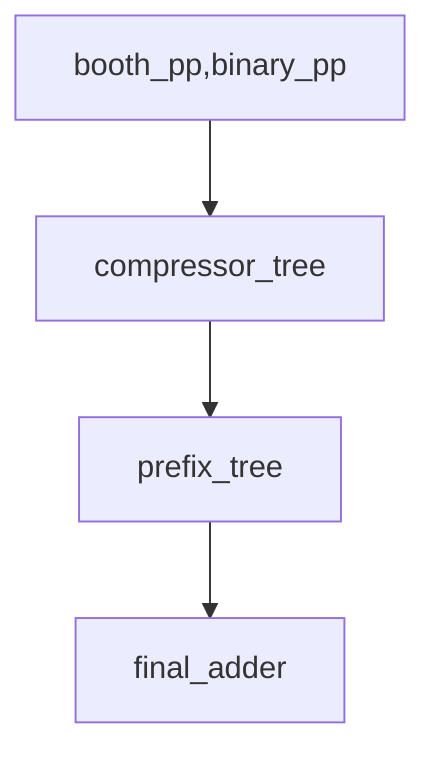

# Lab 2: Deconstruction of an integer multiplier

## Lab Objectives

The goal of this lab is to do the following tasks.

1. Write parametric Ripple-Carry `rtl/rca.sv`, Carry-Lookahead `rtl/cla.sv`, and
   Carry-Select adders `rtl/csa.sv` usign `rtl/ha.sv`+`rtl/fa.sv` from Lab1.
   For carry-lookahead adders, you have to write `rtl/gpk.sv` to produce
   generate, propagate and kill signals. Evaluate functional correctness.
   Evaluate ASIC mapping area, delay and power cost. In particular, we are
   looking for delay distribution of per-bit output delay to ensure the three
   adders are correctly implemented. The most suitable one will become
   `rtl/final_adder.sv` for the last step.
2. Develop `rtl/binary_pp.sv` and `rtl/booth_pp.sv` for generation of partial
   products and show functional correctness. Evaluate ASIC mapping area, delay,
   power cost using TSMC 65nm.
3. Write `compressor_tree.py` generator to produce compressor tree
   `rtl/compressor_tree.sv` using `rtl/ha.sv` and `rtl/fa.sv` you developined in
   Lab1.

   You will have to support the following number formats:
   - unsigned binary
   - signed binary
   - signed modified booth

   You will generate the compressor tree under three schemes:
   - Dadda
   - Bickerstaff
   - FA-only
     Prove functional correctness of the compressor tree generated RTL. Evaluate
     ASIC mapping area, delay, power cost using TSMC 65nm.
     A large part of the code including argument parsing, helper functions, and
     plotting/visualization/Verilog writers have been provided to you.

4. Develop `rtl/prefix_cell.sv` for creating the generate, propagate, alive signal
   blocks as needed for carry prefix calculations in the final adder stage.
   Evaluate ASIC mapping area, delay, power cost using TSMC 65nm.
5. Write `prefix_tree.py` to generate parallel prefix trees `rtl/prefix_tree.sv`
   under following schemes:
   - Brent-Kung
   - Sklanksky
   - Kogge-Stone
     Show functional correctness. Evaluate ASIC mapping area, delay, power costs
     using TSMC 65nm.
     This is mostly blank as it is rather trivial.
6. Assemble a complete multiplier with four stages `booth_pp.sv|binary_pp.sv` ->
   `compressor_tree.sv` -> `prefix_tree.sv` -> `final_adder.sv` to generate the
   multiplication result in a configurable way allowing you to explore how each
   stage is constructed (e.g. Width W, block size M, number format, tree
   algorithm, prefix topology, choice of FA/HA cells with static/mirror options
   if available in TSMC65 or externally supplied as custom cells for those that
   did exceptional Lab1 layout).



7. Make sure all designs are functionally correct. Explore area, delay, power
   costs in each case and explore effect of pipelining on performance.
8. A stretch goal worthy of ARITH 2026 paper would be to do a complete
   transistor-level assembly Python package that customizes all per-bit building
   blocks FA, HA, GPK, PREFIX_CELL, BOOTH_PP. Each cell is designed, sized, laid out
   (not all stages can be automated, especially not layout). If you can outperform
   (or come close to) existing library cells on area/delay/power metrics you
   have a pathway to a paper that could show others how to design-space explore
   various options to maximize silicon density.

Pre-Requisites:

- `verilog` manual for those unfamiliar. https://git.uwaterloo.ca/ece493t31-f25_arith/manuals/verilog
- `hw-sim` manual for digital simulations. https://git.uwaterloo.ca/ece493t31-f25_arith/manuals/hw-sim
- `asic-impl` manual for digital simulations. https://git.uwaterloo.ca/ece493t31-f25_arith/manuals/asic-impl

## Verilog for adders

Before you start this section, study different kinds of adders [Dinechin Chapter 5.3].

You will write Verilog for your parametric adders in the file `rtl/{rca|csa|cla}.sv`. You will use `rtl/ha.sv` and `rtl/fa.sv` from Lab1.
You will also have to write Verilog for `rtl/gpk.sv` for per-bit generate,
propagate, and kill bit creation.

The following are the I/O ports of the `rtl/{rca|csa|cla}.sv`:

1. `clk` : clock input
2. `rst` : reset input
3. `a` : W-bit operand
4. `b` : W-bit operand
5. `c_in` : 1b carry-in
6. `s` : W-bit sum out
7. `c_out` : 1b carry-out

The following are the I/O ports of the `rtl/gpk.sv`

1. `clk` : clock input
2. `rst` : reset input
3. `a` : 1-bit operand
4. `b` : 1-bit operand
5. `g` : 1-bit generate signal
6. `p` : 1-bit propagate signal
7. `k` : 1-bit kill signal

Note the parameters will vary by module. All adders wil. have width `W` as a
parameter. For carry-select and carry-lookahaead adder, a parameter `M` will
determine chunk (or block) size. What's that? Read the textbook. You must
correctly implement all three variants as the delay from input to each sum bit
output will be different for each variant.

The modules also have an optional `PIPE` boolean parameter that chooses between
combinational(PIPE=0) and pipelined(PIPE=1) variants.

## Verilog for binary and booth partial products

Before you start this section, study booth encoding [Dinechin Chapter 8.3, and
Weste-Harris Chapter 11.9.3].

You will write Verilog for the booth partial product generator as per the
formula $4^iZ_iY$. This generates partial product for the term $Z_i \times Y$ in
the Modified Booth encoded format.

The following are the I/O ports of the `rtl/binary_pp.sv`:

1. `clk` : clock input
2. `rst` : reset input
3. `y` : W-bit Y operand
4. `bin_bit` : 1-bit X operand
5. `pp` : W+1-bit partial product (sign extended, but the shift+additional sign adjustment must be handled in
   the compressor tree using Baugh-Wooley inverted MSB trick)

The following are the I/O ports of the `rtl/booth_pp.sv`:

1. `clk` : clock input
2. `rst` : reset input
3. `y` : W-bit Y operand
4. `booth_bits` : 3-bit X operand (converted to base-4 Z)
5. `pp` : W+1-bit partial product (shift must be handled in compressor tree code)
6. `cpl` : 1-bit carry propagate bit

The modules have an optional `PIPE` boolean parameter that chooses between
combinational(PIPE=0) and pipelined(PIPE=1) variants.

## Verilog for generate/propagate/alive cells

Before you start this section, study fast adders [Dinechin Chapter 5.3].

You will also write Verilog for the prefix cell for fast carry generation.
Recall, this is simply combining generate, propagate, alive bits from `hi` and
`lo` ranges.

The following are the I/O ports of the `rtl/prefix_cell.sv`:

1. `clk` : clock input
2. `rst` : reset input
3. `g_hi|a_hi|p_hi`: 1-bit generate/alive/propagate bits from high input
4. `g_lo|a_lo|p_lo`: 1-bit generate/alive/propagate bits from low input
5. `g_out|a_out|p_out`: 1-bit generate/alive/propagate bits outputs that combined the
   span

The module has an optional `PIPE` boolean parameter that chooses between
combinational(PIPE=0) and pipelined(PIPE=1) variants.

### Verilog Simulation

Once you've implemented the Verilog for the cells, you can simulate them exhaustively or selectively.
Check command-line options of the `generate_*.py` code.

```
python3 data/generate_gpk_data.py -o data/ -r tb/
make run DUT=gpk PIPE={0|1}
python3 data/generate_adder_data.py -w {8|16|32} -m 0 -o data/ -r tb/
make run DUT=rca PIPE={0|1}
python3 data/generate_adder_data.py -w {8|16|32} -m {2|4|8} -o data/ -r tb/
make run DUT={csa|cla} PIPE={0|1}
python3 data/generate_{binary_pp|booth_pp|prefix_cell}_data -w {8|16|32} -o data/ -r tb/
make run DUT={binary_pp|booth_pp|prefix_cell} PIPE={0|1}
```

Caution: For signed arithmetic handling in RCA, use M==0 to enable it. For all
other values of M (when instantiated in CSA) please use unsigned mode only.
You'll handle signed arithmetic in the outer module. Pay attention to `-m 0` flag
being passed to `generate_adder.py` when testing RCA stand-alone.

The testbenches rely on test parameters in `tb/top.h` that is auto-generated by
the Python _generate_ code. Do not muck this up unless there's a bug.

The Verilator test bench will report correctness and failed tests.

## Python generators for `rtl/compressor_tree.sv`

Before you start this section, study compressor tree [Dinechin Chapter 7 and 7.3
in particular, and Chapter 11.9 from Weste-Harris].

You have to modify a parametric generator for compressor tree that takes in a
variety of options! The key objective is to implement signed binary, and signed
Booth multipliers. Sign extensions must be done with the Baugh-Wooley inverted
MSB trick.

For instance, the following command will generate a compressor tree for an 8x8
unsigned multiplication with binary encoding using Dadda's algorithm.

```
python3 compressor_tree.py -w 4 --encoding=binary --unsigned -s --visualize --algorithm=faonly -o rtl/compressor_tree.sv # Fig 7.6 + 7.7 in Dinechin/Kumm book
python3 compressor_tree.py -w 8 --encoding=binary --unsigned -s --visualize --algorithm=dadda -o rtl/compressor_tree.sv # Fig 7.19 in Dinechin/Kumm book
python3 compressor_tree.py -w 8 --encoding=binary --unsigned -s --visualize --algorithm=bickerstaff -o rtl/compressor_tree.sv # Fig 7.20 in Dinechin/Kumm book
```

The `--visualize` option will show you a dot diagram using code I've already
supplied to you.

- Here is the raw ANSI-colored chart: [bitheap.txt](./bitheap.txt) (cat
  bitheap.txt on the terminal will show pretty colors for FAs and HAs you can
  cross-refernce with the textbook)
- Here is the HTML version: [bitheap.html](./bitheap.html)

Some dot diagrams to admire..

- Golden reference for 4x4 unsigned FAONLY: [Fig 7.6](./fig7.6.txt)
- Golden reference for 8x8 unsigned Dadda: [Fig 7.19](./fig7.19.txt)
- Golden reference for 8x8 unsigned Bickerstaff: [Fig 7.20](./fig7.20.txt)

The three compressor tree generators are tested to be correct for unsigned
arithmetic under various combinations of width!

The generated FA/HA circuit is also saved as `graph.dot` which can be viewed as
follows to create a PDF file you can open with any viewer:

```
dot -Tpdf graph.dot -o graph.pdf
```

You can compare this netlist view to the textbook chapter diagrams (particularly
Fig 7.7 for 4x4b unsigned multiplication with FA-only)

Once the RTL is generated, we have to test this for correctness. We first
generate synthetic data with partial products as inputs and the sum + carry
vectors as output. This is done by `data/generate_compressor_tree_data.py` file.
The important thing to note is that the exact assignment of results bits to
sum|carry does not matter as the final sum is `sum+carry` and is done in the
fast adder later. This is checked in the RTL testbench with the
`make run` command.

Thus, a minimal 3-step tango to run the compressor tree generator is shown
below:

```
python3 data/generate_compressor_tree_data.py -w 8 -e binary --unsigned -o data/
-r tb/
python3 compressor_tree.py -w 8 --encoding=binary --unsigned -s --visualize --algorithm=dadda -o rtl/compressor_tree.sv -r tb/ # Fig 7.19 in Dinechin/Kumm book
-r tb/
make run DUT=compressor_tree PIPE=0
```

## Python generators for `rtl/prefix_tree.sv`

Before you start this section, study prefix trees [Dinechin Chapter 5.3,
Weste-Harris Chapter 11.2].

You have to design a parametric generator for the prefix tree that takes in a
variety of options!

For instance, the following command will generate a prefix tree for 16 inputs
using Kogge-Stone.

```
python3 prefix_tree.py -w 8 --technique=sklansky --graphviz --verilog -o rtl/prefix_tree.sv# Fig 5.18 in Dinechin/Kumm book
python3 prefix_tree.py -w 8 --technique=kogge-stone --graphviz --verilog -o rtl/prefix_tree.sv # Fig 5.19 in Dinechin/Kumm book
```

The file is empty and will need to be built from scratch unlike
`compressor_tree.py` lazy bums!

Thus, a minimal 3-step tango to run the prefix tree generator is shown
below:

```
python3 data/generate_prefix_tree_data.py -w 8 -o data/ -r tb/
python3 prefix_tree.py -w 8 --technique=sklansky --visualize -o rtl/prefix_tree.sv # Fig 5.18 in Dinechin/Kumm book
-r tb/
make run DUT=prefix_tree PIPE=0
```

## Final Multiplier Assembly `multiplier.sv`

You will have to generate`rtl/multiplier.sv`. You can do this with a
`multiplier.sh` script which you have to write. This will call all the other
generators in a parametric manner. The generator parameters pick

- width (w)
- encoding (binary|booth)
- compressor tree (dadda|bickerstaff|fanoly)
- prefix tree (kogge-stone|brent-kung|sklanksy)
- final adder (just bitwise xor to generate final sum)
- pipelining (int) You will also add pipelining options and explore
  various pipelining strategies. Go crazy here! Feel free to pipeline the partial
  product outputs, internals of the compressor tree, prefix tree, final adder, etc
  as you deem fit!

This will be tested by calling

```
./multiplier.sh W=<> ENCODING=<> COMPRESSOR_ALGORITHM=<>
PREFIX_ALGORITHM=<> FINAL_ADDER=<> M=<> PIPE=<>
make run DUT=multiplier
sudo --preserve-env=SSH_AUTH_SOCK /usr/local/bin/student-container-start.sh
cd ece493t31-f25/labs/okelsawy-lab2
make asic DUT=multiplier PIPE=0
```

This will generate `rtl/multiplier.sv` and ensure that `rtl/compressor_tree.sv`
and `rtl/prefix_tree.sv` are generated to match this module.

You will have to write `data/generate_multipler_data.py` in the same vein as
other synthetic data generators.

You will also have to write `tb/test_multiplier.sv` to check multiplier outputs
in the same vein as other test benches I have supplied.
